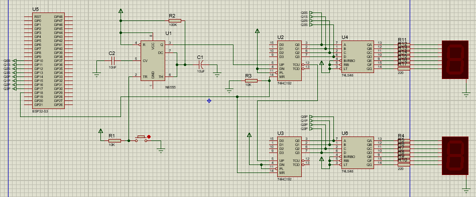

# Smart Queueing System based on ESP32-S3

## 📖 Deskripsi Proyek
Sistem antrean cerdas berbasis mikrokontroler ESP32-S3 yang dirancang untuk mendigitalisasi proses pengambilan nomor dan pemanggilan antrean. Proyek ini dikembangkan sebagai prototipe fungsional untuk mata kuliah Elektronika Digital yang menggabungkan IoT ESP32-S3 dengan Elektronika Digital Klasik. 
*(Catatan: Ini merupakan proyek kolaborasi tim. Repositori ini difokuskan pada perancangan perangkat keras, integrasi komponen, pemrograman mikrokontroller, dan perakitan fisik yang menjadi tanggung jawab utama saya).*

## 🎯 Peran Saya (Hardware Integration, Prototyping, and programming)
Sebagai penanggung jawab perangkat keras (Hardware Executor), tugas teknis saya meliputi:
* Menerjemahkan rancangan logika sistem antrean ke dalam bentuk sirkuit fisik yang fungsional.
* Memilih spesifikasi perangkat I/O (Input/Output) yang kompatibel dengan tegangan kerja (5V) dari ESP32-S3.
* Melakukan penyolderan, *wiring* antarmuka komponen ke mikrokontroler, dan meminimalisir *noise* pada jalur kelistrikan.
* Memastikan tidak ada *logic error* pada tingkat perangkat keras (seperti masalah *floating pin dan shorting*).

## 🛠️ Alat dan Bahan (Bill of Materials)
* **Mikrokontroler Utama:** Modul ESP32-S3.
* **Integrated Circuit:** 74HC48 BCD Decoder, 74HC192 Decade Counter, dan NE555 Timer.
* **Modul Input:** Push Button.
* **Modul Output:** Seven Segment Common Cathode.
* **Komponen Pasif:** Resistor (untuk konfigurasi *pull-up/pull-down*), kapasitor, kabel jumper, PCB dot matrix.

## 📐 Skematik Rangkaian dan Arsitektur
*(Unggah gambar skematik yang Anda buat di sini)*

**Pemilihan ESP32-S3:**
Mikrokontroler ini dipilih karena jumlah pin GPIO-nya yang melimpah, sangat ideal untuk menangani banyak perangkat input (tombol loket) dan output (layar antrean) secara bersamaan tanpa memerlukan IC *multiplexer* tambahan. Selain itu, fitur WiFi *built-in* memungkinkan sistem ini dikembangkan lebih lanjut menjadi antrean berbasis *web*.

## 🚧 Tantangan Teknis & Pemecahan Masalah
Proses perakitan sistem digital ini memiliki beberapa tantangan khusus yang berhasil diselesaikan:
1. **Isu Hardware Bouncing:** Saat tombol antrean ditekan satu kali, terkadang sistem membaca dua hingga tiga kali ketukan (*multiple triggers*). 
   * *Solusi:* Saya mendesain rangkaian *debounce* fisik menggunakan kombinasi resistor dan kapasitor (RC Filter) pada jalur tombol, memastikan sinyal digital yang masuk ke ESP32-S3 benar-benar bersih.
2. **Keterbatasan Daya untuk Display:** (Ceritakan jika Anda mengalami layar meredup atau teks tidak jelas karena tegangan terbagi dengan buzzer/komponen lain, dan bagaimana Anda mengatur jalur daya 5V/3.3V nya).

## 📸 Dokumentasi Prototipe Fisik
*(Sertakan foto alat yang sudah dirakit, fokuskan pada detail wiring yang rapi atau layar saat menyala)*
* [Foto keseluruhan alat Smart Queueing System]
* [Foto detail koneksi pin I/O pada ESP32-S3]
