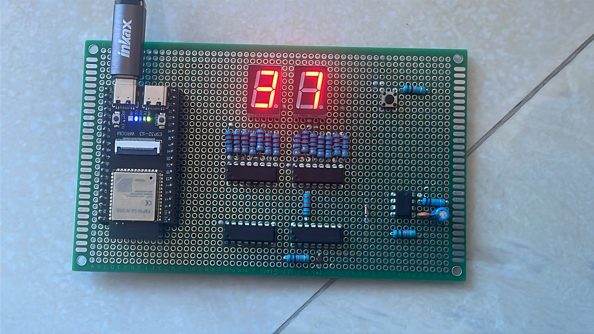
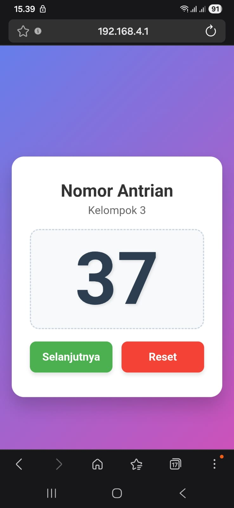

# Smart Queueing System based on ESP32-S3

## 📖 Deskripsi Proyek
Sistem antrean cerdas berbasis mikrokontroler ESP32-S3 yang dirancang untuk mendigitalisasi proses pengambilan nomor dan pemanggilan antrean. Proyek ini dikembangkan sebagai prototipe fungsional untuk mata kuliah Elektronika Digital yang menggabungkan IoT ESP32-S3 dengan Elektronika Digital Klasik. 
*(Catatan: Ini merupakan proyek kolaborasi tim. Repositori ini difokuskan pada perancangan perangkat keras, integrasi komponen, pemrograman mikrokontroller, dan perakitan fisik yang menjadi tanggung jawab utama saya).*

## 🎯 Peran Saya (Hardware Integration, Prototyping, and programming)
Sebagai penanggung jawab perangkat keras (Hardware Executor), tugas teknis saya meliputi:
* Menerjemahkan rancangan logika sistem antrean ke dalam bentuk sirkuit fisik yang fungsional.
* Memilih spesifikasi perangkat I/O (Input/Output) yang kompatibel dengan tegangan kerja (5V) dari ESP32-S3.
* Melakukan penyolderan, *wiring* antarmuka komponen ke mikrokontroler, dan meminimalisir *noise* pada jalur kelistrikan.
* Memastikan tidak ada *logic error* pada tingkat perangkat keras (seperti masalah *floating pin dan shorting*).

## 🛠️ Alat dan Bahan (Bill of Materials)
* **Mikrokontroler Utama:** Modul ESP32-S3.
* **Integrated Circuit:** 74HC48 Decoder Seven Segment, 74HC192 Decade Counter, dan NE555 Timer.
* **Modul Input:** Push Button.
* **Modul Output:** Seven Segment Common Cathode.
* **Komponen Pasif:** Resistor (untuk konfigurasi *pull-up/pull-down*), kapasitor, Dioda, kabel jumper, PCB dot matrix.

## 📐 Skematik Rangkaian dan Arsitektur

**ESP32-S3:**
Mikrokontroler ini dipilih karena jumlah pin GPIO-nya yang melimpah dan memiliki output 5V, sangat ideal untuk menangani banyak perangkat input (tombol loket) dan output (seven segment) secara bersamaan tanpa memerlukan IC *multiplexer* tambahan. Selain itu, fitur WiFi *built-in* memungkinkan sistem ini dikembangkan lebih lanjut menjadi antrean berbasis *web*.
**IC NE555 Timer:**
Dikonfigurasi dalam mode *Monostable Multivibrator* yang berfungsi sebagai unit signal conditioner dari push button. Menghilangkan efek getaran mekanis (bouncing) pada lempengan tombol saat ditekan user yang bisa menyebabkan eror hitungan. Keluaran pulsa dari IC ini bertindak sebagai sinyal Clock Up utama untuk menggerakkan IC pencacah angka.
**IC 74HC192 Decade Counter:**
Sebuah Synchronous 4-Bit Up/Down Decade Counter yang berfungsi sebagai otak penyimpan memori hitungan aritmatika. Secara alami menghitung bilangan biner dari nilai 0 hingga 9 (0000 sampai 1001) dan otomatis meriset kembali ke 0 pada pulsa ke-10. Memiliki pin Terminal Count Up (TCU) yang mengirimkan pulsa otomatis ke IC digit berikutnya (puluhan) ketika digit satuan berganti dari angka 9 ke 0, sehingga sistem dapat menghitung hingga angka 99.
**IC 74HC48 Decoder Seven Segment:**
Komponen ini bertanggung jawab penuh dalam menjembatani komunikasi data mesin ke visual yang mudah dibaca oleh manusia. Menerima data biner 4-bit dari IC Counter dan menerjemahkannya menjadi 7 jalur logika keluaran aktif (Active-High).

## 🚧 Tantangan Teknis & Pemecahan Masalah
Proses perakitan sistem digital ini memiliki beberapa tantangan khusus yang berhasil diselesaikan:
1. **Isu Hardware Bouncing:** Saat tombol antrean ditekan satu kali, terkadang sistem membaca dua hingga tiga kali ketukan (*multiple triggers*). 
   * *Solusi:* Saya mendesain rangkaian *debounce* fisik menggunakan kombinasi resistor dan kapasitor (RC Filter) pada jalur tombol, memastikan sinyal digital yang masuk ke ESP32-S3 benar-benar bersih.
2. **Seven Segment Hanya Menampilkan Angka Genap Saja:** Saat tombol antrean ditekan, sistem tidak menampilkan angka ganjil ia hanya menampilkan angka bernilai genap saja.
   * *Solusi:* Saya memeriksa jalur pengkabelan pada IC 74HC192 pin 3 dan IC 74HC48 pin 7 menggunakan multimeter dan menemukan shorting, sehingga saya menyolder ulang untuk jalur pengkabelan tersebut.

## 📸 Dokumentasi Prototipe Fisik
*(Sertakan foto alat yang sudah dirakit, fokuskan pada detail wiring yang rapi atau layar saat menyala)*
* [Foto keseluruhan alat Smart Queueing System]
  
  
* [Foto Aplikasi Pada Web Server ESP32-S3]
  
* [Video Penjelasan Project]
  https://youtube.com/shorts/Kd2lgHZTZds?si=a0qoj_4h-vZTpTNv
* [LinkedIn]
  https://www.linkedin.com/posts/irfannazril_elektronikadigital-iot-embeddedsystems-ugcPost-7473794222920470528-VVTZ/?utm_source=share&utm_medium=member_desktop&rcm=ACoAAERhsnwBjF_VUf9EbxjIvbiume9VyBmdP1s
